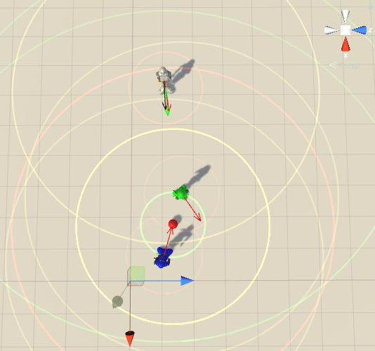
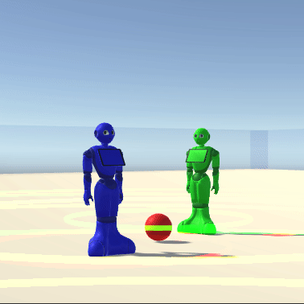
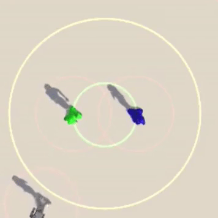
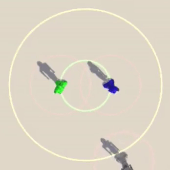

# Pepper Social Scenarios
The pepper social scenarios is implemented using ml-agents. It is still under development. This repo is provided for the Paper [Social Behavior Learning with Realistic Reward Shaping]()

**Tested Unity version:** 2018.1.0b13 (beta)
**Tested Unity ML-Agents version:** 0.3.1b

## Environments
**Pepper robot approaches people:** The pepper robot needs to approach people from a right angle: 
[@alexyuangao](http://twitter.com/alexyuangao)

#### Visualization of personal, social and public spaces of different agent and a sample of image-based observation
 

#### Base Behaviour

#### Learned Behaviour
Approaching from the left and right side by taking care of personal, social and public space. Learned policy can enable robot to approach from any point in the space:

  

## Project Prerequisite
* The [TensorflowSharp](https://github.com/Unity-Technologies/ml-agents/blob/master/docs/Background-TensorFlow.md#tensorflowsharp) plugins folder was omitted from this project due to the massive file sizes. You will need to import this set of Unity plugins yourself. You can download the TensorFlowSharp plugin as a [Unity package here](https://s3.amazonaws.com/unity-ml-agents/0.3/TFSharpPlugin.unitypackage).

* We strongly recommend users to get familiar with Unity [ML-agent](https://github.com/Danielhp95/ml-agents).

* We recommend using a python virtual environment to manage Python dependencies. For this we recommend using [Anaconda](https://www.anaconda.com/), a powerful virtual environment and package management tool. 

* The Unity game engine is required. [Linux installation download link](https://forum.unity.com/threads/unity-on-linux-release-notes-and-known-issues.350256/page-2)

* (Optional) Vision module can be found [here](https://github.com/mightypirate1/AutoEnc_House).

## Getting Started

### Creating a virtual Python environment using Anaconda

1. Inside of `ml-agents/python/` directory run `conda create -n myenv python=3.6`.
2. Activate the virtual environment by running `source activate myenv`
3. Install requirements from `requirements.txt` by running `pip install -r requirements.txt`

#### Known Problems of this section.
- If you lack grpc dependences after installing using `requirements.txt`, please install the dependence using `pip install grpcio`.

### Building pepper social environment

#### Build prerequisites:
+ Set scripting runtime version to `.NET 4.x Equivalent` inside File-> Build Setting-> PlayerSettings -> Other Settings -> Scripting Runtime Version.
+ Set `ENABLE_TENSORFLOW` inside File-> Build Setting-> PlayerSettings -> Other Settings -> Scripting Define Symbols.
+ Make sure that the relevant `Brain`s are set to external in the inspector.

#### Open PepperSocial scene File
1. Use `Unity Editor` to open the project folder. Then use `Ctrl+o` to open scene file by following the path `PepperSocial/Assets/Scenarios/PepperSocial/PepperSocial.unity`.

#### Create a build inside of Unity Headleslly for Linux
1. Go to File -> Build Settings.
2. Tick **Headless mode** box.
3. Set **Target platform** to Linux (x86_64 build).
This will create two files:

` <environmentName>_Data/` and `<environmentName>.x86_64`

We strongly recomend to move these files inside an `environments/` directory inside of the ml-agents `python/` directory. Such that we get:

`python/environments/<environmentName>_Data/` and `python/environments/<environmentName>.x86_64`

### Running training from Python
Inside of the `ml-agents/python/` directory, run the command:  
`python learn.py environments/<environmentName>.x86_64 --train`

## Follow Us
### Yuan Gao

* Twitter: [@alexyuangao](http://twitter.com/alexyuangao)
* Blog: [yuangao.ai](http://yuangao.ai)

### Martin Frisk

* Twitter: 

## Code states
BASELINE-v0 https://github.com/gaoyuankidult/PepperSocial/tree/6a506f3b43f48b881d5d8828e0f781e115a8b155
