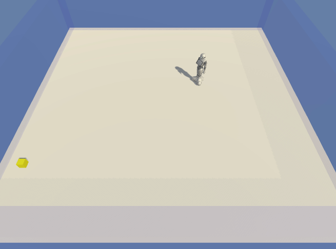

# Pepper Social Scenarios
The pepper social scenarios is implemented using ml-agents. It is still under development.

**Unity version:** 2018.1.0b13 (beta)
**Unity ML-Agents version:** 0.3.1b

## Environments
**Pepper robot approaches people:** The pepper robot needs to approach people from a right angle: 
* +0.1 if getting closer.
* -0.05 time penalty.
* +1.0 when reaching target.

## Project Setup
* The [TensorflowSharp](https://github.com/Unity-Technologies/ml-agents/blob/master/docs/Background-TensorFlow.md#tensorflowsharp) plugins folder was omitted from this project due to the massive file sizes. You will need to import this set of Unity plugins yourself. You can download the TensorFlowSharp plugin as a [Unity package here](https://s3.amazonaws.com/unity-ml-agents/0.3/TFSharpPlugin.unitypackage).

## Follow Me
* Twitter: [@alexyuangao](http://twitter.com/ActiveNick)
* Blog: [github.io](gaoyuankidult.github.io)
